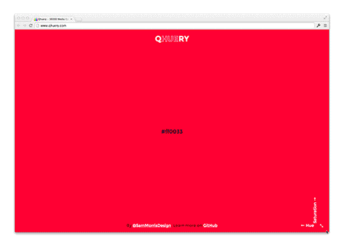

Qhuery
=======

A stupid sass experiment with colours. It generates 36000 media queries that change the body's background colour. There's no real point to it, but you've gotten this far so you must be curious. You're probably looking for [`queries.scss`](scss/queries.scss).

## Demo

Visit the [live site](http://www.qhuery.com) (Warning, might kill your browser). Here's a gif preview just in case.

## Requirements

- [Node](nodejs.org) 20 or above

## Usage

For the first time use `npm install` to get dependencies and then run `npm run build` to build the project.

